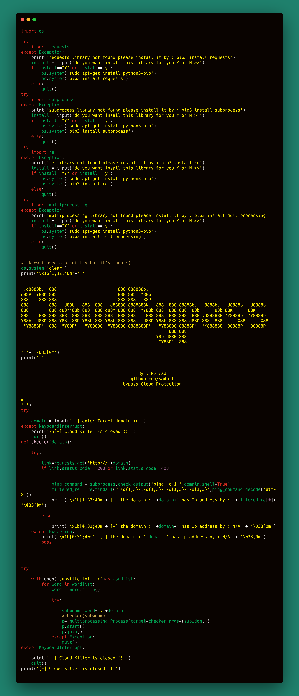

### CloudBypass
best tool to bypass cloudflare made with  Python3
easy & best 


### Usage:
```
git clone https://github.com/sadult/cloudbypass.git
cd cloudbypass
pip3 install -r requirments.txt
python3 cloud_killer.py

then just enter target domain name and waite for result
```

### Tested:
```
Tested on Kali linux and ubuntu
also it work for all linux distributions
for windows you may get problem with installing librarys but it work
```
